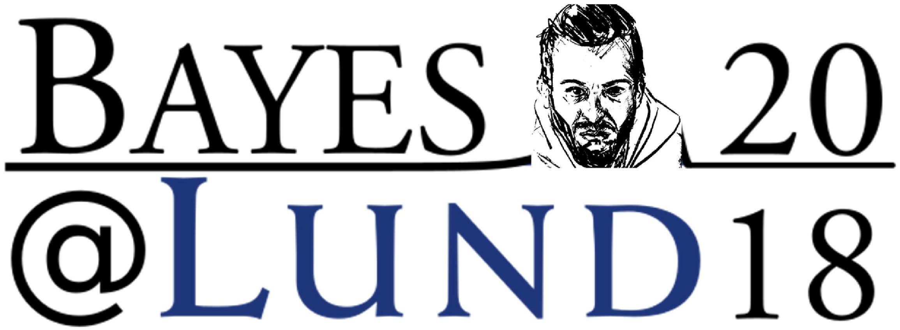

# Analyzing an experiment on involuntary attention using **```brms```**



Description, analysis, and preliminary results of an experiment investigating involuntary attentional orienting using a temporal order judgment procedure. Analysis was done using the *R* package `brms`.

This was my first attempt at creating a slide deck in *RStudio* using the *R* package `xaringan`. Source code [here](https://github.com/aschetti/2018.04.12_Bayes_at_Lund/blob/master/Schettino_BayesAtLund2018.Rmd), presentation in *pdf* [here](https://github.com/aschetti/2018.04.12_Bayes_at_Lund/blob/master/output/Schettino_Analyzing_an_experiment_on_involuntary_attention_using_brms.pdf), working presentation in *html* on [my website](https://asch3tti.netlify.com/post/bayesatlund2018/).


