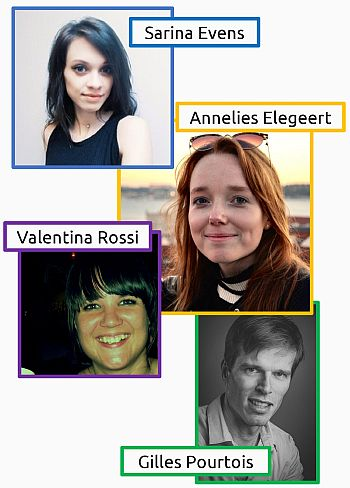

```{r setup, include=FALSE}
# use pacman to install and load relevant packages
pacman::p_load("knitr", # dynamic report generation
               "Rmisc", # for advanced summary functions
               # WARNING: "Rmisc" requires "plyr", which gives problems with group_by function in "dplyr"
               # --> solution: load "dplyr" (part of "tidyverse") after "plyr"
               "tidyverse", # install the following packages: ggplot2, tibble, tidyr, readr, purrr, dplyr
               "ggthemes", # more themes for ggplot2
               "grid", # for plot annotations
               "kableExtra", # construct complex table with 'kable' and pipe syntax
               "brms", # Bayesian Regression Models using Stan
               "ESTER") # Efficient Sequential Testing with Evidence Ratios

options(htmltools.dir.version=FALSE,
        knitr.table.format="html") # table format
```

layout: true

<!-- set header and footer (from Schettino_UGent_CSS.css) -->
<div class="my-footer"><span>Antonio Schettino   
&emsp;&emsp;&emsp;&emsp;&emsp;&emsp;&emsp;&emsp;&emsp;&emsp;&emsp;&emsp;&emsp;
&emsp;&emsp;&emsp;&emsp;&emsp;&emsp;&emsp;&emsp;&emsp;&emsp;&emsp;&emsp;&emsp;
&emsp;&emsp;&emsp;&emsp;&emsp;&emsp;&emsp;&emsp;&emsp;&emsp;&emsp;&emsp;&emsp;
&emsp;&emsp;&emsp;&emsp;&emsp;&emsp;
Bayes@Lund - 12.04.2018</span></div>

<!-- set FontAwesome icons -->
<link rel="stylesheet" href="https://cdnjs.cloudflare.com/ajax/libs/font-awesome/4.7.0/css/font-awesome.min.css">
<div class="my-header"></div>

<!-- ################################### -->
<!-- ############# OUTLINE ############# -->
<!-- ################################### -->

---
name: outline

<Div style="margin-top:130px" /> <!-- start below university header -->

.left[
  .font200[
    **OUTLINE**
  ]
]

--

* research question

--

.font100[ <!-- text wrapped in .font100 to avoid change in font size (bug?) -->
  * experimental paradigm
]

--

* pilot

--

.font100[
  * experiment 1
]

--

* conclusions

--
<!-- add collaborators picture  -->
<Div style="margin-top:-370px" /> 

.right[
  
]

<!-- ################################### -->
<!-- ######## RESEARCH QUESTION ######## -->
<!-- ################################### -->

---
name: TOJ_rationale

<Div style="margin-top:130px" /> <!-- start below university header -->

## Research question

--


---
<!-- 
.center[
  .font150[
    <br /><br /><br /><br />
    **Attention** mechanisms direct (in *time* and *space*) <br />
    our limited processing resources towards <br />
    **salient** information to efficiently improve behavior <br />
    (James, 1890; Posner, 1980; Sokolov, 1963)
  ]
]
-->


<!-- 
```{r data_pilot, echo=FALSE, warning=FALSE, message=FALSE, fig.height=5.5, fig.width=5.5, dev='svg'}
data.pilot <- read_csv("TOJ_pilot.csv") %>% # load data
  select(participant=Participant, SOA, cue=MainConds, response=Resp) %>% # select and rename variables of interest
  mutate(participant=as.factor(participant), # convert participant as factor
         SOA=recode(factor(SOA), # convert SOA to factor
                    # add "+" to positive SOAs (useful for graphs)
                    "17"="+17",
                    "83"="+83",
                    "150"="+150",
                    "217"="+217"),
         cue=recode(factor(cue), # convert cue to factor and change level names
                    "NoCue"="no.cue", "Horiz1st"="vertical.cued", "Vert1st"="horizontal.cued")) %>%
  group_by(participant, SOA, cue) %>% # groups
  summarize(num.horiz1st=length(which(response==2)), # number of "horizontal first" responses
            tot.trials=length(response==2), # total number of trials
            prop.horizfirst=num.horiz1st/tot.trials) %>% # proportion of "horizontal first" responses
  ungroup() %>%
  summarySEwithin(., # summarize data
                  measurevar="prop.horizfirst", # dependent variable
                  withinvars=c("SOA", "cue"), # independent variables
                  idvar="participant") %>% # ID variable
  select(SOA, cue, prop.horizfirst, CI95.prop=ci) # select and rename variables of interest

# include annotations on x-axis
# (https://stackoverflow.com/questions/31079210/how-can-i-add-annotations-below-the-x-axis-in-ggplot2#31081162)
text.L <- textGrob("vertical first", gp=gpar(fontsize=14))
text.R <- textGrob("horizontal first", gp=gpar(fontsize=14))

ACC.plot <- ggplot(data.pilot, aes(SOA, prop.horizfirst, group=cue, color=cue, fill=cue)) + # basic graph
  geom_line(size=1.3) + # lines: thickness
  geom_ribbon(aes(ymin=prop.horizfirst-CI95.prop, ymax=prop.horizfirst+CI95.prop), # ribbons (mean +/- 95% CI)
              color="white", # ribbon: color of external line
              alpha=.3) + # ribbon: transparency
  geom_point(aes(shape=cue), # points at each SOA
             fill="white", # point shape: color fill
             size=3) + # point shape: size
  scale_color_manual(values=c("red", "black", "blue")) + # different line colors per conditions
  scale_fill_manual(values=c("red", "black", "blue")) + # different ribbon colors per conditions
  scale_x_discrete("SOA", # x-axis: title
                   limits=levels(data.pilot$SOA)) + # x-axis: SOAs (positive are on the right)
  ylab("prop. \"horizontal first\" responses") + # y-axis: title
  scale_y_continuous(breaks=seq(0, 1, .25)) + # x-axis: tick marks
  geom_hline(yintercept=seq(0, 1, .25), # reference lines
             linetype="dotted", # line: type
             colour="#999999", # line: color
             size=.8, # line: thickness
             alpha=.5) + # line: transparency
  annotation_custom(text.L, xmin=2, xmax=2, ymin=-.2, ymax=-.2) + # annotation on x-axis
  annotation_custom(text.R, xmin=8, xmax=8, ymin=-.2, ymax=-.2) + # annotation on x-axis
  theme_pander(base_size=15, pc="white", lp=c(.2,.85)) + # custom theme
  theme(plot.margin=unit(c(1, 1, 2, 1), "lines")) # make room for the annotations

# override clipping
ACC.plot <- ggplot_gtable(ggplot_build(ACC.plot))
ACC.plot$layout$clip[ACC.plot$layout$name == "panel"] <- "off"
grid.draw(ACC.plot)
```
 -->


<!-- ################################### -->
<!-- ########### EXAMPLE TOJ ########### -->
<!-- ################################### -->

---
name: TOJ_video
background-image: url("TOJ_video.gif")
background-size: 700px
background-position: 50% 80%

.center[
<br /><br /><br />
.font200[**Counterproductive subliminal TOJ**]
]

---
name: TOJ1
background-image: url("TOJ1.png")
background-size: 500px
background-position: 50% 60%

.center[
<br /><br /><br />
.font200[**Counterproductive subliminal TOJ**]
]

.center[
<br /><br /><br /><br /><br /><br /><br /><br /><br /><br />
.font150[*2000 ms*]
]

---
name: TOJ2
background-image: url("TOJ2.png")
background-size: 500px
background-position: 50% 60%

.center[
<br /><br /><br />
.font200[**Counterproductive subliminal TOJ**]
]

.center[
<br /><br /><br /><br /><br /><br /><br /><br /><br /><br />
.font150[*17 ms*]
]

---
name: TOJ3
background-image: url("TOJ3.png")
background-size: 500px
background-position: 50% 60%

.center[
<br /><br /><br />
.font200[**Counterproductive subliminal TOJ**]
]

.center[
<br /><br /><br /><br /><br /><br /><br /><br /><br /><br />
.font150[*34 ms*]
]

---
name: TOJ4
background-image: url("TOJ4.png")
background-size: 500px
background-position: 50% 60%

.center[
<br /><br /><br />
.font200[**Counterproductive subliminal TOJ**]
]

.center[
<br /><br /><br /><br /><br /><br /><br /><br /><br />
.font150[*SOA <br /> (217, 150, 83, 17, 0 ms)*]
]

---
name: TOJ5
background-image: url("TOJ5.png")
background-size: 500px
background-position: 50% 60%

.center[
<br /><br /><br />
.font200[**Counterproductive subliminal TOJ**]
]

.center[
<br /><br /><br /><br /><br /><br /><br /><br /><br /><br />
.font150[*100 ms*]
]

---
name: TOJ6
background-image: url("TOJ6.png")
background-size: 500px
background-position: 50% 60%

.center[
<br /><br /><br />
.font200[**Counterproductive subliminal TOJ**]
]

.center[
<br /><br /><br /><br /><br /><br /><br /><br /><br /><br />
.font150[*until response*]
]

<!-- ################################### -->
<!-- ############## PILOT ############## -->
<!-- ################################### -->

---
name: TOJ_pilot_graph

background-image: url(TOJ_pilot.svg)
background-size: 600px
background-position: 50% 65%

<!-- incremental lists are problematic (i.e., changes in font formatting) -->
---
name: TOJ_pilot_analysis_desc1

<Div style="margin-top:130px" /> 

## Bayesian multilevel modeling

---
name: TOJ_pilot_analysis_desc2

<Div style="margin-top:130px" /> 

## Bayesian multilevel modeling

* linear mixed-effects models, random intercepts and slopes

---
name: TOJ_pilot_analysis_desc3

<Div style="margin-top:130px" /> 

## Bayesian multilevel modeling

* linear mixed-effects models, random intercepts and slopes
* participants as group-level (= *random*) effect

---
name: TOJ_pilot_analysis_desc4

<Div style="margin-top:130px" /> 

## Bayesian multilevel modeling

* linear mixed-effects models, random intercepts and slopes
* participants as group-level (= *random*) effect
* **default** priors (for now)

---
name: TOJ_pilot_analysis_desc5

<Div style="margin-top:130px" /> 

## Bayesian multilevel modeling

* linear mixed-effects models, random intercepts and slopes
* participants as group-level (= *random*) effect
* **default** priors (for now)
* model comparison

---
name: TOJ_pilot_analysis_desc6

<Div style="margin-top:130px" /> 

## Bayesian multilevel modeling

* linear mixed-effects models, random intercepts and slopes
* participants as group-level (= *random*) effect
* **default** priors (for now)
* model comparison
  1. **full** model (**SOA** x **cue**)

---
name: TOJ_pilot_analysis_desc7

<Div style="margin-top:130px" /> 

## Bayesian multilevel modeling

* linear mixed-effects models, random intercepts and slopes
* participants as group-level (= *random*) effect
* **default** priors (for now)
* model comparison
  1. **full** model (**SOA** x **cue**)
  2. main effects (**SOA** + **cue**)

---
name: TOJ_pilot_analysis_desc8

<Div style="margin-top:130px" /> 

## Bayesian multilevel modeling

* linear mixed-effects models, random intercepts and slopes
* participants as group-level (= *random*) effect
* **default** priors (for now)
* model comparison
  1. **full** model (**SOA** x **cue**)
  2. main effects (**SOA** + **cue**)
  3. main effect of **SOA**

---
name: TOJ_pilot_analysis_desc9

<Div style="margin-top:130px" /> 

## Bayesian multilevel modeling

* linear mixed-effects models, random intercepts and slopes
* participants as group-level (= *random*) effect
* **default** priors (for now)
* model comparison
  1. **full** model (**SOA** x **cue**)
  2. main effects (**SOA** + **cue**)
  3. main effect of **SOA**
  4. main effect of **cue**

---
name: TOJ_pilot_analysis_desc10

<Div style="margin-top:130px" /> 

## Bayesian multilevel modeling

* linear mixed-effects models, random intercepts and slopes
* participants as group-level (= *random*) effect
* **default** priors (for now)
* model comparison
  1. **full** model (**SOA** x **cue**)
  2. main effects (**SOA** + **cue**)
  3. main effect of **SOA**
  4. main effect of **cue**
  5. **null** model

---


---
name: bye

.center[
<br /><br /><br />
.font300[**Thanks for your attention!**]
]

<br /><br />
.center[
  .font150[
    <a href="mailto:antonio.schettino@ugent.be"> <i class="fa fa-paper-plane fa-fw" style="font-size:30px;color:#152bda;"> </i>&nbsp; antonio.schettino@ugent.be</a><br>
    <a href="https://asch3tti.netlify.com/"><i class="fa fa-link fa-fw" style="font-size:30px;color:black;"></i>&nbsp; asch3tti.netlify.com</a><br>
    <a href="https://twitter.com/asch3tti"><i class="fa fa-twitter fa-fw" style="font-size:35px;color:#00aced;"></i>&nbsp; @asch3tti</a><br>
<br />
Slides available here: https://osf.io/8yzgq/
  ]
]


